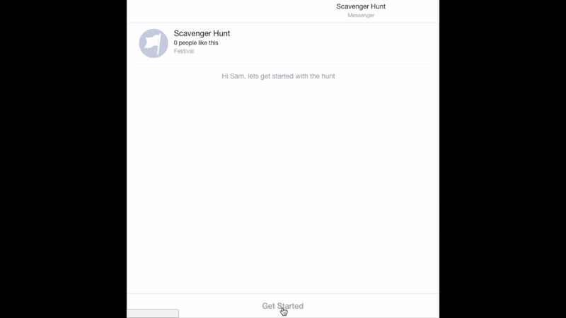

#Scavenger Hunt Facebook Messenger Bot

This application is a Facebook bot that manages a conversation with a user, directing them to a location where a prize is hidden.



##Set Up

After signing up or linking your Facebook account to the [Facebook Developer page](https://developers.facebook.com/), follow the instructions to create a new app. Once you have created your application, I would suggest reading the [Getting Started Guide](https://developers.facebook.com/docs/messenger-platform/guides/quick-start).

Things you will need:
- Facebook Page: This is the page that users will message your bot though.
- Webhook: I will go into more detail about setting up webhooks below.
- Page Access Token: Which you can find under the Messenger Tab of Product Settings in the 'Token Generation' section.
- App Secret: Which you can find under the Dashboard tab on your app's webpage.
- Validation Token: A token you choose to verify your application with your Facebook page.

###Webhook Setup

Webhooks receive `POST` requests from Facebook (when the user sends messages to your bot) and subsequently send `POST` requests back to Facebook (when your bot responds to the user). I am running my webhook using Node and Express.

```javascript
const express = require('express');
const bodyParser = require('body-parser');
const crypto = require('crypto');

var app = express();
app.set('port', process.env.PORT || 8080);
app.use(bodyParser.json({ verify: verifyRequestSignature }));

function verifyRequestSignature(req, res, buf) {
  var signature = req.headers["x-hub-signature"];

  if (!signature) {
    console.error("Couldn't validate the signature.");
  } else {
    var elements = signature.split('=');
    var method = elements[0];
    var signatureHash = elements[1];

    var expectedHash = crypto.createHmac('sha1', APP_SECRET)
                        .update(buf)
                        .digest('hex');

    if (signatureHash != expectedHash) {
      throw new Error("Couldn't validate the request signature.");
    }
  }
}
```

Now, we are going to create a `/webhook` route which is written specifically to be authenticated by Facebook to send and receive `POST` requests.

```javascript
app.get('/webhook', function(req, res) {
  if (req.query['hub.mode'] === 'subscribe' &&
      req.query['hub.verify_token'] === USER_DEFINED_VALIDATION_TOKEN) {
    console.log("Validating webhook");
    res.status(200).send(req.query['hub.challenge']);
  } else {
    console.error("Failed validation. Make sure the validation tokens match.");
    res.sendStatus(403);
  }
});
```

Start up your servers

```javascript
app.listen(app.get('port'), function() {
  console.log('Node app is running on port', app.get('port'));
});
```

Finally, you can host your webhook on Heroku or, for development, host it locally. Facebook needs a secure `HTTPS` protocol to validate the webhook. I used [ngrok](https://ngrok.com/) which will host files you run locally on their servers.

##Scavenger Hunt Bot

###Data Storage

My bot is simple, it doesn't query a database, but if it did, it would query a noSQL database with collections set up as such.

```javascript
const PRIZE_LOCATIONS = {
  sanFrancisco: [
    {
      id: 1,
      name: 'Golden Gate Park',
      coordinates: {
        lat: 37.7694,
        long: -122.4862
      },
      clues: [
        'Clue 1',
        'Clue 2',
        'Clue 3'
      ]
    },
    {
      id: 2,
      name: 'Presidio',
      coordinates: {
        lat: 37.7989,
        long: -122.4662
      },
      clues: [
        'Clue 1',
        'Clue 2',
        'Clue 3'
      ]
    }
  ]
};
```

This object is organized by cities holding a reference to the location where prizes are hidden and the clues to get to the prize.

###User Progress

The user's progress is kept track throughout the hunt so the bot knows where the user is in the hunt.

```javascript
const PROGRESS = {
  city: null,
  prizeLocation: null,
  clueIndex: 0,
  foundPrize: false
};
```

The progress is updated as the user continues to message the bot.

```javascript
function updateProgress(key, value) {
  PROGRESS[key] = value;
}
```

Additionally, the user has the option to start over at any point by typing in the words 'start over' and the application will call the `resetProgress()` function.

###Conversation Loops

The bot always knows where the user is in the scavenger hunt based on the user's PROGRESS object. During the conversation, if the user makes and accidental input or nonsensical input the bot will prompt the user with the information it needs to continue the user through the scavenger hunt. Every time the user sends a message, the bot will check the progress of that user to know which questions it needs to ask the user so it can gather the necessary information.

```javascript
function checkProgress(senderID) {
  var clueArray;
  if (PROGRESS.city && PROGRESS.prizeLocation)
    PRIZE_LOCATIONS[PROGRESS.city].forEach(prizeLocation => {
      if (prizeLocation.name === PROGRESS.prizeLocation)
        clueArray = prizeLocation.clues;
    });

  if (!PROGRESS.city) {
    var preText = "I need to know which city you're in to get started.";
    sendCityRequest(senderID, preText);
  } else if (PROGRESS.city === 'other') {
    sendTextMessage(senderID, "Sorry, you're not located in one of our " +
      "active cities. Remember you can always type 'start over' to change" +
      "your current city.");
  } else if (!PROGRESS.prizeLocation) {
    var preText = "I am going to need to know your location " +
      "so I can send you to your prize.";
    sendLocationRequest(senderID, preText);
  } else if (PROGRESS.clueIndex === 0) {
    sendClueReadyRequest(senderID);
  } else if (PROGRESS.clueIndex > 0 && PROGRESS.clueIndex < clueArray.length) {
    sendNextClueReadyRequest(senderID);
  } else if (PROGRESS.clueIndex === clueArray.length) {
    sendPrizeConfirmation(senderID);
  }
}
```

With this `checkProgress()` function it ensures that the application will not break upon accidental or nonsensical user input.

###Game Completion

Once a user finds a prize and confirms that the prize has been found, the bot will know that the prize no longer exists and will delete the associated location from the PRIZE_LOCATIONS object. Additionally, the bot will call the `resetWinner()` function, which resets everything but the `city` key the PROGRESS object.
